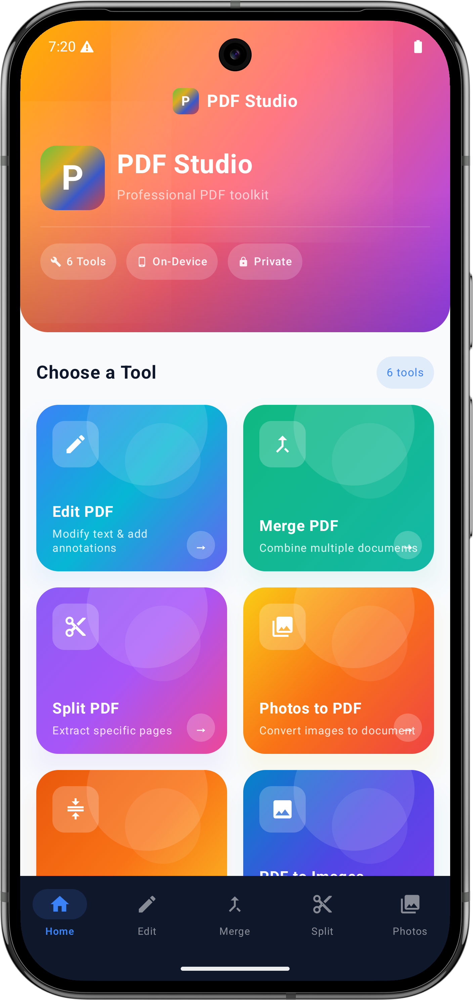
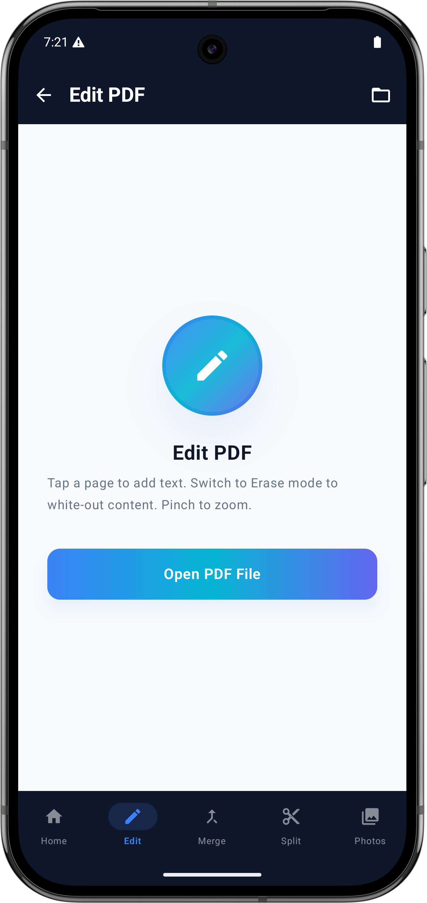
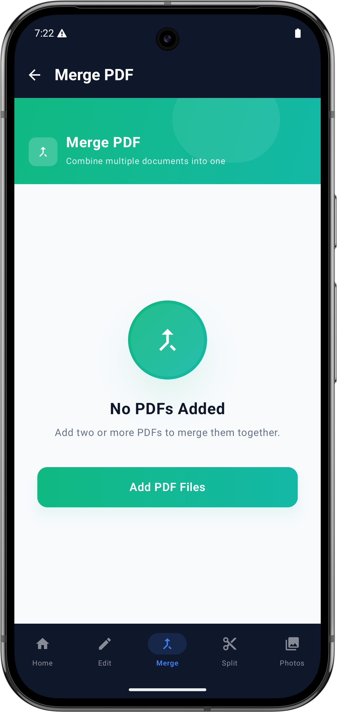

# PDF Studio — Android

A professional PDF toolkit for Android built with **Jetpack Compose** and **Kotlin**. All processing happens entirely on-device — your files never leave your phone.

## Features

| Tool | Description |
|---|---|
| **Edit PDF** | Add text annotations and erase content with pinch-to-zoom support |
| **Merge PDF** | Combine multiple PDF documents into a single file |
| **Split PDF** | Extract specific pages from a PDF into separate files |
| **Photos to PDF** | Convert images from your gallery into a PDF document |
| **Compress PDF** | Reduce PDF file size while preserving quality |
| **PDF to Images** | Export each page of a PDF as an image |

## Screenshots

<p align="center">
  
  &nbsp;&nbsp;
  
  &nbsp;&nbsp;
  
</p>

## Tech Stack

- **Language:** Kotlin
- **UI:** Jetpack Compose + Material 3
- **Architecture:** MVVM (ViewModel per feature)
- **Navigation:** Navigation Compose
- **Min SDK:** 24 (Android 7.0)
- **Target SDK:** 36

## Project Structure

```
app/src/main/java/com/example/androidpdfstudio/
├── screens/          # Composable screens (Home, EditPDF, MergePDF, …)
├── viewmodels/       # Feature ViewModels
├── components/       # Reusable UI components
├── models/           # Data models and tool definitions
├── navigation/       # NavGraph & Screen routes
├── utils/            # PDFProcessor and helpers
└── ui/theme/         # Colors, typography, and theme
```

## Getting Started

1. Clone the repo
2. Open in **Android Studio Meerkat** or later
3. Sync Gradle and run on a device or emulator (API 24+)

## Privacy

All PDF operations are performed locally using Android's built-in APIs. No data is uploaded to any server.
